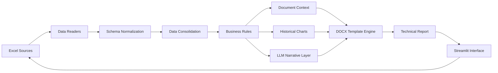

<div align="center">

# Technical Report Automation Pipeline

### Pipeline modular para transformar dados estruturados em relatórios técnicos automatizados

Ingestão de planilhas · Normalização de dados · Regras de cálculo · Visualização · LLM · DOCX

<br>


</div>

<br>


<p align="center">
  
</p>

## Overview

**Tudo aqui representa uma parte do trabalho que desenvolvo diariamente com automação, engenharia de dados e construção de soluções em Python.**

Fiz com que um processo técnico, repetitivo e dependente de várias etapas manuais transformar em um fluxo estruturado, reproduzível e mais seguro.

Desenvolvi uma aplicação capaz de receber diferentes planilhas, tratar suas particularidades e transformar esses dados em um relatório técnico consolidado no formato .docx. Mais do que automatizar a geração de um documento, o projeto organiza todo o caminho percorrido pela informação: da leitura dos arquivos até a entrega final do relatório, com cálculos, análises, gráficos e geração narrativa integrados em uma única solução.

          A aplicação executa um fluxo completo de processamento:

          - recebe múltiplas fontes de dados em Excel;
          - identifica automaticamente as referências temporais disponíveis;
          - normaliza estruturas, colunas e nomenclaturas;
          - consolida bases com diferentes finalidades em uma estrutura única;
          - aplica regras de negócio e cálculos comparativos entre períodos;
          - gera gráficos de séries históricas a partir dos dados processados;
          - organiza um contexto analítico estruturado para geração narrativa opcional com IA;
          - renderiza tabelas, textos e imagens em um template Word;
          - disponibiliza o documento final por meio de uma interface desenvolvida em Streamlit.

Eu organizei o projeto em módulos independentes para separar ingestão, tratamento de dados, regras de cálculo, visualização, integração com IA e geração documental. Essa arquitetura facilita manutenção, testes e evolução da aplicação, além de permitir que novas regras, fontes de dados ou modelos de relatório sejam incorporados sem comprometer todo o fluxo.

*OBS: essa é uma versão pública do meu trabalho, utiliza estruturas genéricas e dados demonstrativos. Informações operacionais, bases reais, regras específicas e documentos institucionais adaptados, seguindo a LGPD. Mantendo disponível a arquitetura e a lógica técnica desenvolvidas.*


---

## Architecture




---

## Application demo


<p align="center">
  <a href="Gravando 2026-07-13 172649.mp4">
    
  </a>
</p>

<p align="center">
  <sub>Clique na imagem para abrir a demonstração em vídeo.</sub>
</p>

---

## Engineering highlights

| Decisão | Implementação |
|---|---|
| Arquitetura modular | Separação entre ingestão, processamento, visualização, geração narrativa e interface |
| Contratos de dados | Uso de `dataclasses` para padronizar resultados entre módulos |
| Normalização de schemas | Conversão de diferentes nomenclaturas de planilhas para uma estrutura interna comum |
| Processamento determinístico | Cálculos realizados em Python antes de qualquer interação com o modelo de linguagem |
| Comparação temporal | Cálculo de variações entre referências por identificadores de categoria |
| Visualização em memória | Gráficos exportados em `BytesIO`, sem necessidade de persistência intermediária |
| Document generation | Renderização dinâmica utilizando `docxtpl` e placeholders Jinja2 |
| LLM desacoplado | A geração narrativa é opcional e não participa dos cálculos |
| Gerenciamento temporário | Arquivos enviados são processados em diretórios temporários |
| Configuração segura | Credenciais externas são carregadas por variáveis de ambiente |

---

## Data flow

```text
Excel files
     │
     ▼
Reading and schema detection
     │
     ▼
Column normalization
     │
     ▼
Data validation and filtering
     │
     ▼
Dataset consolidation
     │
     ▼
Historical calculations
     │
     ├──────────────► Charts
     │
     ├──────────────► Structured LLM context
     │
     ▼
DOCX rendering context
     │
     ▼
Automated technical report
```

---

## Main capabilities

### Data ingestion

Recebe diferentes fontes Excel e converte seus conteúdos para estruturas internas padronizadas.

          O processo contempla:

          - leitura automatizada das planilhas;
          - identificação de colunas temporais;
          - detecção da referência atual e anterior;
          - normalização de nomes de campos;
          - tratamento de valores ausentes;
          - remoção de linhas sem identificadores válidos.

### Dataset consolidation

Bases com diferentes naturezas são processadas separadamente e consolidadas em uma estrutura única.

*Fiz uma etapa de integração que utiliza identificadores técnicos para controlar duplicidades e manter consistência entre as fontes.*

----------------------------------------------------------------------------------------

### Historical calculations

Comparei valores entre períodos e calcula variações percentuais por categoria.

          As regras incluem tratamento para:

          - registros sem referência anterior;
          - valores ausentes;
          - novos registros;
          - divisões por zero;
          - diferentes níveis de variação.

Os resultados também alimentam regras visuais utilizadas no documento final.

------------------------------------------

### Automated visualizations

Gráficos de séries históricas são gerados com Matplotlib a partir dos dados já processados.

As imagens são mantidas em memória e inseridas diretamente no documento Word, reduzindo dependência de arquivos intermediários.

----------------------------------------
### LLM-assisted narrative

Eu ainda estou lapidando essa etapa, no progeto real, então aqui a geração narrativa é uma camada opcional executada após o processamento dos dados.

          LLM recebe um contexto estruturado:

          - quantidade de registros analisados;
          - períodos de referência;
          - médias calculadas;
          - principais variações;
          - agrupamentos por segmento;
          - novos registros identificados.

          O modelo não é utilizado como mecanismo de cálculo ou fonte da verdade numérica. Sua responsabilidade é converter resultados previamente computados em texto técnico estruturado.

          A aplicação também permanece funcional quando a integração com o modelo está desabilitada.
--------------

### Document automation

O documento final é construído a partir de um template `.docx` utilizando `docxtpl` e Jinja2.

          O processo permite preencher dinamicamente:

          - período de referência;
          - identificação do relatório;
          - tabelas analíticas;
          - destaques visuais;
          - textos narrativos;
          - gráficos históricos.

O layout permanece desacoplado das regras de processamento, permitindo alterar o documento sem reconstruir o pipeline de dados.

---

## Technology stack

| Layer | Technologies |
|---|---|
| Language | Python 3.12 |
| Data processing | Pandas, NumPy |
| Excel ingestion | Pandas, OpenPyXL |
| Application interface | Streamlit |
| Visualization | Matplotlib |
| Document generation | docxtpl, python-docx, Jinja2 |
| Generative AI | OpenAI API / (sendo testada até o momento 13-07-2026 o Cortex da Snowflake)
| Configuration | python-dotenv |

---

## Project structure

```text
technical-report-automation/
│
├── app.py
│   └── Application entry point
│
├── template/
│   ├── report_generator.py
│   │   └── Pipeline orchestration and Streamlit interface
│   │
│   ├── data_readers.py
│   │   └── Excel ingestion and schema normalization
│   │
│   ├── charts.py
│   │   └── Historical visualization generation
│   │
│   ├── text_generator.py
│   │   └── Structured LLM integration
│   │
│   └── utils.py
│       └── Data contracts, constants and shared rules
│
├── templates/
│   └── template_exemplo.docx
│       └── Public document template
│
├── sample_data/
│   ├── exemplo_variacoes.xlsx
│   └── exemplo_mdo.xlsx
│
├── docs/
│   └── assets/
│       ├── application-preview.png
│       ├── video-cover.png
│       └── application-demo.mp4
│
├── .env.example
├── .gitignore
├── requirements.txt
├── README.md
└── LICENSE
```

---

## Running locally

### 1. Clone the repository

```bash
git clone https://github.com/SEU-USUARIO/technical-report-automation.git

cd technical-report-automation
```

### 2. Create the virtual environment

```bash
python -m venv .venv
```

Windows PowerShell:

```powershell
.venv\Scripts\Activate.ps1
```

Linux or macOS:

```bash
source .venv/bin/activate
```

### 3. Install dependencies

```bash
pip install --upgrade pip

pip install -r requirements.txt
```

### 4. Configure the optional LLM integration

Create a `.env` file from the provided example.

Windows:

```powershell
copy .env.example .env
```

Linux or macOS:

```bash
cp .env.example .env
```

Environment configuration:

```env
OPENAI_API_KEY=
OPENAI_MODEL=gpt-4o-mini
```

The API key is optional. The data pipeline, charts and document generation remain available without the narrative generation layer.

### 5. Start the application

```bash
streamlit run app.py
```

The local interface will be available at:

```text
http://localhost:8501
```

---

## Input contracts

### Variation dataset

Minimum expected structure:

| Field | Description |
|---|---|
| `codigo` | Unique category identifier |
| `descricao` | Category description |
| `unidade` | Unit of measurement |
| `segmento` | Analytical segment |
| `preco_anterior` | Previous reference value |
| `preco_atual` | Current reference value |
| `variacao_decimal` | Variation represented as a decimal |
| Date columns | Historical observations |

Example:

```text
codigo | descricao | unidade | segmento | preco_anterior | preco_atual | variacao_decimal
CAT001 | Categoria A | h | Construção | 10.00 | 10.50 | 0.05
```


## Author

**Isabel Gonçalves**

Engenharia de dados e automação são o meu dia a dia :)

Gosto de transformar processos complexos e repetitivos em soluções mais estruturadas, confiáveis e fáceis de operar. Tenho desenvolvido pipelines de dados, automatizo fluxos analíticos e construo aplicações que tornam informações técnicas mais simples de processar, analisar e disponibilizar.

Este repositório faz parte do meu portfólio técnico e representa o tipo de solução que desenvolvo na prática: projetos orientados a ambientes produtivos, construídos com Python, engenharia de dados e automação inteligente.

---

## License

Distributed under the MIT License.

See [`LICENSE`](LICENSE) for additional information.
